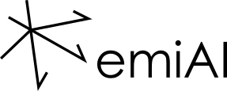

# emiAI

emiAI is a framework for the "inversion" of electromagnetic 
induction imaging (EMI) data based on a deep learning network written in Python using
Keras and Tensorflow. It covers the generation training data, the training and evaluation of the deep learning (DL) network and the 
prediction of 1D vertical electrical conductivity (EC) models from measured 
vertical coplanar (VCP) apparent electrical conductivity (ECa) data. 

The framework basically takes care of the following steps:
1. Generation of training models for the deep learning network from electrical
resistivity data. The training models consist of 3 measured VCP ECa values and 
EC depth models with 4, 6 and 12 depth layers.
2. Training and evaluation of the DL network
3. Prediction of the 1D vertical EC models. 

## Installation

Install the required packages and dependencies in new conda environment:

> ```bash
> conda env create -f environment.yml
> ```

This work would not have been possible withou many other open-source libraries, so please have also a look at the following repositories and consider citing the corresponding articles:

https://gitlab.com/hkex/resipy

https://gitlab.com/hkex/emagpy

https://github.com/keras-team/keras

## Usage

The workflow consists of running the numbered Python scripts in sequence:

> ```bash
> python 01_generate_1Dmodels.py
> python 02_compute_forward_response.py
> python 03_DLN_train.py
> python 04_DLN_predict.py
> ```

The script `01_generate_1Dmodels.py` does parse a .json file (`settings.json`) containing settings and some keyword parameters can be set upon calling the script. For all other scripts, parameters have to be changed in the scripts directly. 

The keyword parameters in `01_generate_1Dmodels.py` are:

- `--plot`: Plot the figures during model generation. This includes the newly 
random generated models, the binning results as well as indication of the sampling
locations. 
- `--aggregate`: Upon model generation aggregate all models for each profile into
a composite model. This composite model can be used for downsampling and is the 
input for the forward computation and training of the DL network.
- `--aggregate_only`: Only aggregate the newly generated models without new model 
generation. This option uses the in the `settings.json` specified profiles. 
- `--downsample`: The DL network requires the training data for 3 different depth 
models with 12, 6 and 4 layers. This option downsamples the composite model for the in 
`settings.json` specified models. 


## Citation ##

[](https://doi.org/10.5281/zenodo.4610836)

If you use the software in a publication then please cite it using the Zenodo
DOI. Be aware that this badge links to the latest package version.

Please select your specific version at https://doi.org/10.5281/zenodo.4610836 to
get the DOI of that version. You should normally always use the DOI for the
specific version of your record in citations. This is to ensure that other
researchers can access the exact research artefact you used for reproducibility.

You can find additional information regarding DOI versioning at
http://help.zenodo.org/#versioning

